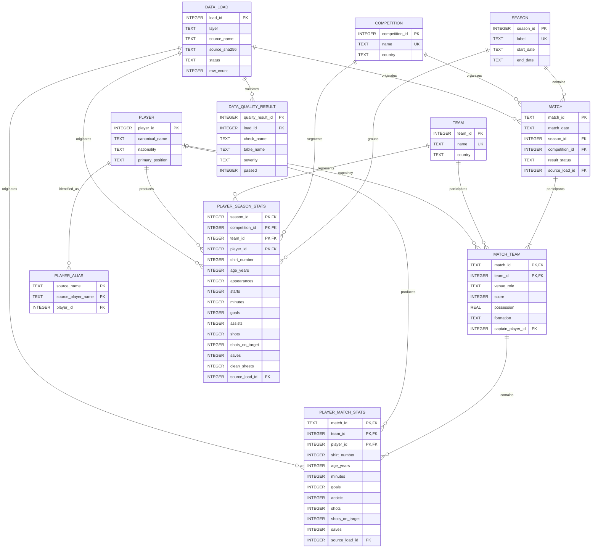

# Football Analytics

Tool for analyzing the sporting performance of football teams. This README is meant for **using the repo** (installing, running, knowing which files go where) — not as a development log.

> 🇪🇸 Versión en español: [README.md](README.md)

## 🎯 Objective

Answer a question that applies to any football team: *why is your team getting these results?* Starting from a season's matches and the nine tables FBref offers, it builds a performance diagnosis, identifying patterns and factors behind the results.

Tested end to end with real data from a full season exported from FBref — the code itself doesn't assume any particular team (see [If your data isn't from FBref](#-if-your-data-isnt-from-fbref) to adapt it to another source).

## 🏗 How the data gets processed

Data moves through three layers. Bronze is versioned by date and time and never overwrites an earlier run:

- **Bronze** — manual FBref `.xls` exports, preserved byte for byte without cleaning or deduplication.
- **Silver** — cleaning and normalization of Bronze data: flattens headers, drops navigation columns, and tidies text, without inventing or imputing values.
- **Gold** — loads Silver into the SQLite database (`database/schema.sql`), ready to query with SQL from the analysis notebook.

## 🗂 Project structure

    data/
      manual_exports/  Inbox for season .xls files manually exported from FBref
      match_exports/{year}/  "Match Report" tables for specific matches (see Loading a specific match)
      bronze/{entity}/{year}/{timestamp}/   Raw XLS + manifest.json
      silver/{entity}/{year}/{timestamp}/   Clean CSV + manifest.json
      database/football_analytics.db        SQLite database (Gold), git-ignored
    logs/               Logs for each pipeline run
    notebooks/
      analisis.ipynb    Diagnosis notebook (fixed questions, see below)
    reports/
      figures/          Charts exported by the notebook
      dashboard_data/   Star-schema CSV for Power BI / Tableau, git-ignored
      dashboard_ejemplo.xlsx  General and player dashboards, already built with formulas and charts
    database/
      schema.sql        Versioned SQLite schema for the analytical model
    src/
      bronze_ingest.py  Validated and auditable manual FBref ingestion
      silver_clean.py   Structural cleaning from Bronze → Silver
      create_database.py  Creates and validates the local SQLite database
      gold_load.py      Loads the latest Silver run into the SQLite database
      load_match_report.py  Loads the player-by-player detail of one specific match
      export_dashboard_data.py  Exports Gold to CSV for the BI dashboards
      utils/
        cleaning.py     Identifies each table by its columns (see below)
        paths.py        Shared project paths
        logging_config.py  Logging setup

## 🛠 Stack

Python · pandas · SQLite · matplotlib · Jupyter Notebook

## 🚀 Installation

```powershell
python -m pip install -r requirements.txt
```

(if `pip` is not recognized as a command, use `python -m pip install -r requirements.txt` instead of `pip install ...` directly)

## ▶️ Obtaining raw data

The project does not attempt to bypass Cloudflare or use undocumented FBref endpoints: all ingestion starts from manual exports.

### What file type it expects

FBref exports through **Share & Export → Get as Excel Workbook**. Despite the `.xls` extension, it is not a real Excel binary — it's an HTML table saved with that extension (a known FBref quirk). That's why `bronze_ingest.py` reads them with `pandas.read_html`, not an Excel parser; open one in a text editor and you'll see HTML.

### What data it needs (the nine required tables)

Each season needs the nine tables from that team's season page on FBref, exported one by one into `data/manual_exports/`. The program doesn't trust the filename or the order you exported them in — it identifies each table by its columns once read (see `identify_table()` in `src/utils/cleaning.py`):

| Table | What it contains | How it's identified |
|---|---|---|
| `resultados` | Match-by-match results | columns `Result`, `GF`, `GA`, `Opponent`, `Venue` |
| `tiros` | Shooting statistics | columns `Sh`, `SoT`, `SoT%` |
| `disciplina` | Cards, fouls, offsides | columns `CrdY`, `Fls`, `Off`, `Crs` |
| `arqueros` | Goalkeeper performance | some column ends in `GA90` and some in `Saves` |
| `minutos_jugados` | Minutes played per player | some column contains `Mn/MP` and some `PPM` |
| `resumen_jugadores_por_competencia` | Player summary broken down by competition | competition-prefixed columns ending in `_Gls` |
| `resumen_arqueros_por_competencia` | Goalkeeper summary broken down by competition | competition-prefixed columns ending in `_CS` |
| `stats_jugadores_liga` | Standard stats, domestic league only | of the two "standard" tables found (columns with `Gls` and `Starts`), the one with the **lower** total minutes sum |
| `stats_jugadores_todas_competencias` | Standard stats, all competitions | of those same two, the one with the **higher** total minutes sum |

If a table is missing, an unrecognized one shows up, or two exports get classified under the same logical name, `bronze_ingest.py` stops with an error explaining exactly what happened — it never publishes a half-finished dataset.

### How to name and place them

Each file (or its containing folder) must include the season's year, so Bronze can group multiple seasons into a single run. You can leave every file together in the inbox, as long as each filename contains the year:

```text
data/manual_exports/2019_sportsref_download.xls
data/manual_exports/2019_sportsref_download (1).xls
data/manual_exports/2026_sportsref_download.xls
```

You may also organize them beforehand in folders (`data/manual_exports/2019/*.xls`); in that case filenames can stay exactly as FBref provides them.

### Running it

```powershell
python src/bronze_ingest.py
```

No seasons or dates are passed on the command line: Bronze scans the whole inbox, groups files by the single year found in the filename or parent folder, and processes every available year. Each year must have its nine required tables; the whole process stops before publishing if a set is incomplete or a file has no unambiguous year. Files are copied byte for byte under descriptive names; source nulls and duplicates remain intact.

Each year is published independently under `data/bronze/{entity}/{year}/{timestamp}/`. Folders are only created for years that have files; unchanged input reuses that year's latest run, and changed input creates a new run without overwriting earlier ones. Bronze preserves everything supplied as-is — selecting an analysis period belongs in Silver or the notebook.

## 🧼 Clean in Silver

```powershell
python src/silver_clean.py
```

Takes the latest Bronze run for every available season, flattens FBref's multi-level headers, drops navigation columns (`Matches`, `Match Report`), and tidies text (whitespace, empty cells, or literal `"nan"`/`"None"` values). It doesn't invent data or impute nulls: it only structures what Bronze already validated. It publishes its own versioned run under `data/silver/{entity}/{year}/{timestamp}/`, with the same manifest and hash scheme as Bronze — an unchanged run reuses the previous one instead of duplicating it.

## 🗄️ Create the database

The MVP uses SQLite to keep the local database portable and reproducible. The schema separates dimensions, matches, team statistics, player and goalkeeper statistics, season aggregates, and data-quality results.

```powershell
python -m src.create_database
```

The command creates `data/database/football_analytics.db`, applies `database/schema.sql`, and validates foreign keys. The model is normalized through 3NF/BCNF; `match_team` represents both teams and each match score without duplicating it in `match`. Optional goalkeeper metrics are stored with the player's remaining statistics in `player_match_stats` and `player_season_stats`. The `.db` file is a local artifact ignored by Git; the SQL schema is version-controlled. This step only creates and validates the schema — to fill it with real data see [Load Gold](#-load-gold-silver--sqlite) below. If the version of a still-disposable database changes, it can be explicitly rebuilt with `python -m src.create_database --recreate`.

### Data model

The normalized database keeps atomic data. Percentages, per-90 metrics, and team totals are calculated through SQL views, so they can later be materialized in Gold without becoming a second source of truth.



When multiple columns are marked as `PK`, together they form one composite primary key. `player_id` identifies the person whether they play outfield or as a goalkeeper; the optional `shots_on_target_against`, `goals_against`, `saves`, and `clean_sheets` metrics live in the same player statistics tables.

| Table | Grain and purpose |
|---|---|
| `team` | One team per row. |
| `competition` | One competition per row. |
| `season` | One season per row. |
| `player` | One person per row, without separating goalkeepers. |
| `player_alias` | One player name as represented by a source. |
| `match` | One fixture, without duplicating teams or scores. |
| `match_team` | One team participating in a match; stores venue role, score, and context. |
| `player_match_stats` | One player, for one team, in one match; contains atomic statistics and optional goalkeeper fields. |
| `player_season_stats` | One player, team, competition, and season; accumulated source snapshot. |
| `data_load` | One processed run or file for traceability. |
| `data_quality_result` | One quality check executed during a load. |
| `schema_version` | Technical SQLite schema version. |

The `vw_team_match_totals`, `vw_player_match_metrics`, and `vw_player_season_metrics` views calculate totals, percentages, goal contributions, and per-90 metrics without duplicating them in normalized tables.

### ⚠️ If your data isn't from FBref

Everything above — column names, the identification logic, even the fact that the `.xls` is really HTML — is built and tested specifically against FBref's export format, using one real season as a reference. If you want to reuse the pipeline with data from another source (another site, another export, or if FBref changes its columns later on), `identify_table()` in `src/utils/cleaning.py` will most likely fail to recognize your files, since it looks for FBref's specific column names. In that case you'll need to adjust those column signatures to match yours — the year-grouping logic (`_year_from_path`, in `bronze_ingest.py`) and Bronze publishing don't depend on FBref and should keep working unchanged.

## 🥇 Load Gold (Silver → SQLite)

```powershell
python src/gold_load.py
```

Takes the most recent Silver run for every available season and loads it into `data/database/football_analytics.db` (creating the schema first if it doesn't exist yet). It's idempotent per season: each run deletes and re-inserts that season's matches and stats instead of accumulating duplicates, so running it again after adding a new season doesn't reprocess or dirty the earlier ones. `data_load` and `data_quality_result` are the exception — they're a historical audit trail and grow on every run on purpose, so you can see when what was loaded.

**What gets loaded and what doesn't (a known limitation):** FBref provides a player summary broken down by competition (`MP`, `Min`, `Gls`, and `Ast`) and a goalkeeper summary (`MP`, `Min`, `GA`, and `CS`). Gold creates separate rows for every real competition found in `resultados` and also retains the **"All competitions"** aggregate. The shooting, discipline, and detailed goalkeeper tables in this export are combined only, so those metrics are stored only under "All competitions" and remain `NULL` for League/Sudamericana instead of duplicating a combined total into each tournament. The league standard table also provides starts, penalties, and cards. `player_match_stats` starts empty because the season export has no match-level player detail; it is populated through [`load_match_report.py`](#-loading-a-specific-match). `match` and `match_team` include all fixtures, and `Squad Total`/`Opponent Total` rows are discarded.

## 🥈 Loading a specific match

```powershell
python -m src.load_match_report --opponent "Opponent name" --date YYYY-MM-DD
```

Complements `gold_load.py`: loads the player-by-player detail of ONE match into `player_match_stats`, and if that match still showed as `scheduled` in the database, fills in its result (`match`, `match_team`). The match has to already exist in `match` — run `gold_load.py` first, even if the result isn't in `resultados.xls` yet.

FBref doesn't export this per season: you have to pull it from that specific match's "Match Report", table by table just like the nine season tables — two tables per team (`Summary` and `Goalkeeper Stats`), exported into `data/match_exports/{year}/` (a folder separate from `data/manual_exports/` on purpose: `bronze_ingest.py` scans `manual_exports/` recursively, and a match table sitting in there could get confused for a season table by column overlap). No need to say which file belongs to which team: it's identified automatically, by comparing each table's player names against the ones already known for this team.

## 📓 Analysis notebook

```powershell
jupyter notebook notebooks/analisis.ipynb
```

`notebooks/analisis.ipynb` answers a fixed set of questions against the loaded Gold database: performance by competition, home vs. away, goals/assists per 90 minutes, and the relationship between ball possession and match result — each with its own table, chart (also saved to `reports/figures/`), and a one-sentence takeaway. Run `bronze_ingest.py` → `silver_clean.py` → `gold_load.py` first to make sure the database is up to date before opening it.

## 📊 Dashboards (Power BI / Excel)

```powershell
python src/export_dashboard_data.py
```

Exports the Gold database to a set of star-schema CSV files ready to import into Power BI or Tableau (`reports/dashboard_data/`: `dim_temporada`, `dim_competencia`, `dim_equipo`, `dim_jugador`, `fact_partidos`, `fact_jugadores_temporada`, `fact_jugadores_partido`) — built to support five dashboards: general (results and average goals by season/competition), attack, defense, individual player, and a specific match. The first three can be built today with the available data; attack and defense stay limited to shooting, discipline and goalkeeping, because FBref doesn't publish passing or defensive-actions tables for this team's competitions; the specific-match one depends on `fact_jugadores_partido`, which starts empty and fills up match by match with [`load_match_report.py`](#-loading-a-specific-match). `reports/dashboard_ejemplo.xlsx` already has the general and player dashboards built, with working formulas and charts, to see something running while the Power BI version gets built.

## 📈 Building the dashboards in Power BI

With the 7 CSVs from `reports/dashboard_data/` generated, in Power BI Desktop:

**Import the data**

1. **Home → Get Data → Text/CSV**, pick `dim_temporada.csv` → **Load**. Repeat this once for each of the 7 files — "Get Data → Folder" doesn't work here, it combines files with different schemas as if they were one.

**Relate the tables**

2. **Model** view (the connected-tables icon, left panel). Power BI auto-detects some relationships by column name; if one's missing, drag a field onto the other to create it. These need to exist:
   - `dim_temporada[Temporada]` ↔ `fact_partidos[Temporada]` and ↔ `fact_jugadores_temporada[Temporada]`
   - `dim_competencia[Competencia]` ↔ `fact_partidos[Competencia]` and ↔ `fact_jugadores_temporada[Competencia]`

   That way one season or competition filter updates every table together, instead of one at a time.

**General dashboard**

3. New page ("+" button at the bottom) → "General". **Visualizations panel → Slicer**: one with `dim_temporada[Temporada]`, another with `dim_competencia[Competencia]`.
4. **Column chart**: Axis = `fact_partidos[Resultado]`, Values = `Resultado` (Power BI counts it on its own — a text field defaults to "Count of Resultado"). This gives the won/drawn/lost bars.
5. Two **Cards**, one with `Goles_Favor` and one with `Goles_Contra` from `fact_partidos` — for each, click the field inside "Values" and change the aggregation from "Sum" to **Average**.

**Attack / Defense dashboards**

6. New page → "Ataque", same two slicers. **Cards** set to Sum with fields from `fact_jugadores_temporada`: `Tiros`, `Tiros_al_Arco`, `Centros`, `Goles`, `Asistencias` — these are the team's totals for the filtered period.
7. New page → "Defensa", same slicers. Cards set to Sum with `Tackles_Ganados`, `Intercepciones`, `Faltas_Cometidas`, `Goles_Recibidos`, `Atajadas`.

**Individual player dashboard**

8. New page → "Jugador". Slicer with `fact_jugadores_temporada[Jugador]` (pick one) and another with `Competencia`.
9. Cards with `Goles`, `Asistencias`, `Goles_por_90`, `%_Tiros_al_Arco`, `%_Conversión_de_Gol`, `Tackles_Ganados`, `Intercepciones` — if the chosen player is a goalkeeper, `Atajadas` and `%_Atajadas` show data too.

**Specific-match dashboard**

10. New page → "Partido". Uses `fact_jugadores_partido`, which starts with a single match loaded (see [Loading a specific match](#-loading-a-specific-match)). Slicer with `fact_jugadores_partido[Fecha]`.
11. **Table** (Visualizations → Table) with `Jugador`, `Equipo`, `Condición_Equipo`, `Goles`, `Asistencias`, `Tiros`, `Tiros_al_Arco`, `Tackles_Ganados`, `Intercepciones` — filtered by the date slicer, telling apart who played for each side with `Condición_Equipo` (Propio/Rival).

## 📈 Current status

Full pipeline working end to end with real FBref data: Bronze, Silver, loading into Gold (SQLite), a diagnosis notebook, and a BI dashboard export.
