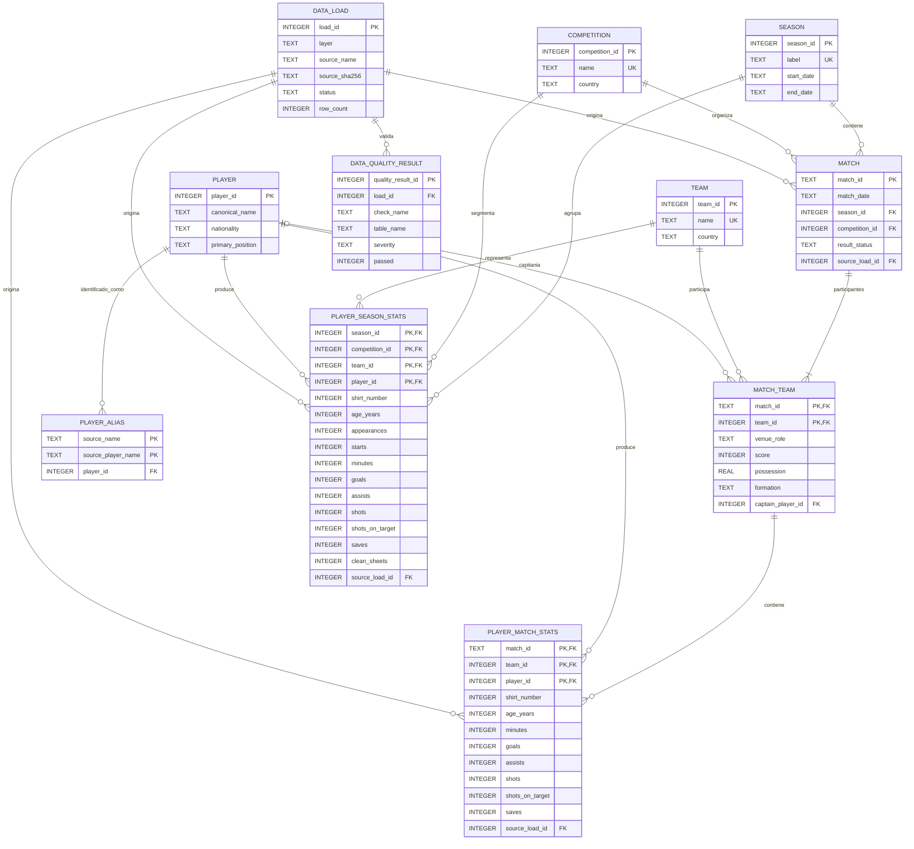

# Football Analytics

Herramienta de análisis del rendimiento deportivo de equipos de fútbol. Este README está pensado para **usar el repo** (instalar, correr, saber qué archivos poner y dónde) — no como bitácora de desarrollo.

> 🇬🇧 English version: [README.en.md](README.en.md)

## 🎯 Objetivo

Responder una pregunta que se puede hacer sobre cualquier equipo de fútbol: *¿por qué tu equipo está obteniendo estos resultados?* A partir de los partidos de una temporada y las nueve tablas que ofrece FBref, arma un diagnóstico del rendimiento, identificando patrones y factores asociados a los resultados.

Se probó de punta a punta con datos reales de una temporada completa exportada de FBref — el código no asume ningún equipo en particular (ver [Si tus datos no son de FBref](#-si-tus-datos-no-son-de-fbref) para adaptarlo a otra fuente).

## 🏗 Cómo procesa los datos

Los datos pasan por tres capas. Bronze se versiona por fecha y hora y nunca sobrescribe una corrida anterior:

- **Bronze** — exports `.xls` manuales de FBref, preservados byte a byte sin limpiar ni deduplicar.
- **Silver** — limpieza y normalización de los datos Bronze: aplana encabezados, descarta columnas de navegación y prolija texto, sin inventar ni imputar valores.
- **Gold** — carga de Silver a la base SQLite (`database/schema.sql`), lista para consultar con SQL desde el notebook de análisis.

## 🗂 Estructura del proyecto

    data/
      manual_exports/  Bandeja de entrada de .xls de temporada exportados a mano desde FBref
      match_exports/{año}/  Tablas de "Match Report" de partidos puntuales (ver Cargar un partido puntual)
      bronze/{entidad}/{año}/{timestamp}/   XLS crudos + manifest.json
      silver/{entidad}/{año}/{timestamp}/   CSV limpios + manifest.json
      database/football_analytics.db        Base SQLite (Gold), ignorada por Git
    logs/               Logs de cada corrida del pipeline
    notebooks/
      analisis.ipynb    Notebook de diagnóstico (preguntas fijas, ver más abajo)
    reports/
      figures/          Gráficos exportados por el notebook
      dashboard_data/   CSV en esquema estrella para Power BI / Tableau, ignorados por Git
      dashboard_ejemplo.xlsx  Dashboards general y jugador, ya armados con fórmulas y gráficos
    database/
      schema.sql        Esquema SQLite versionado del modelo analítico
    src/
      bronze_ingest.py  Ingesta manual, validada y auditable de exports FBref
      silver_clean.py   Limpieza estructural de Bronze → Silver
      create_database.py  Crea y valida la base SQLite local
      gold_load.py      Carga la corrida más reciente de Silver a la base SQLite
      load_match_report.py  Carga el detalle jugador a jugador de un partido puntual
      export_dashboard_data.py  Exporta Gold a CSV para los dashboards de BI
      utils/
        cleaning.py     Identifica cada tabla por sus columnas (ver mas abajo)
        paths.py        Rutas compartidas del proyecto
        logging_config.py  Configuracion de logs

## 🛠 Stack

Python · pandas · SQLite · matplotlib · Jupyter Notebook

## 🚀 Instalación

```powershell
python -m pip install -r requirements.txt
```

(si `pip` no se reconoce como comando, usar `python -m pip install -r requirements.txt` en vez de `pip install ...` directo)

## ▶️ Obtener datos crudos

El proyecto no intenta evadir Cloudflare ni utilizar endpoints no documentados de FBref: toda la ingesta parte de exports manuales.

### Qué tipo de archivo espera

FBref exporta con **Share & Export → Get as Excel Workbook**. A pesar de la extensión `.xls`, no es un binario de Excel real — es una tabla HTML guardada con esa extensión (una particularidad conocida de FBref). Por eso `bronze_ingest.py` los lee con `pandas.read_html`, no con un parser de Excel; si abrís uno con un editor de texto vas a ver HTML.

### Qué datos necesita (las nueve tablas requeridas)

Para cada temporada hacen falta las nueve tablas de la página de esa temporada del equipo en FBref, exportadas una por una a `data/manual_exports/`. El programa no confía en el nombre del archivo ni en el orden en que los exportaste — identifica cada tabla por sus columnas una vez leída (ver `identify_table()` en `src/utils/cleaning.py`):

| Tabla | Qué contiene | Cómo se identifica |
|---|---|---|
| `resultados` | Resultado partido a partido | columnas `Result`, `GF`, `GA`, `Opponent`, `Venue` |
| `tiros` | Estadísticas de tiro | columnas `Sh`, `SoT`, `SoT%` |
| `disciplina` | Tarjetas, faltas, offsides | columnas `CrdY`, `Fls`, `Off`, `Crs` |
| `arqueros` | Rendimiento de arqueros | alguna columna termina en `GA90` y alguna en `Saves` |
| `minutos_jugados` | Minutos jugados por jugador | alguna columna contiene `Mn/MP` y alguna `PPM` |
| `resumen_jugadores_por_competencia` | Resumen de jugadores desglosado por competencia | columnas con prefijo de competencia terminadas en `_Gls` |
| `resumen_arqueros_por_competencia` | Resumen de arqueros desglosado por competencia | columnas con prefijo de competencia terminadas en `_CS` |
| `stats_jugadores_liga` | Estadísticas estándar, solo liga local | de las dos tablas "estándar" (columnas con `Gls` y `Starts`), la de **menor** suma total de minutos |
| `stats_jugadores_todas_competencias` | Estadísticas estándar, todas las competencias | de esas mismas dos, la de **mayor** suma total de minutos |

Si falta alguna tabla, sobra una no reconocida, o dos exports quedan clasificados con el mismo nombre lógico, `bronze_ingest.py` corta con un error explicando exactamente qué pasó — nunca publica un dataset a medias.

### Cómo nombrarlos y dónde ponerlos

Cada archivo (o su carpeta contenedora) tiene que incluir el año de la temporada, así Bronze puede agrupar varias temporadas en una sola corrida. Podés dejar todos los archivos juntos en la bandeja de entrada, siempre que cada nombre contenga el año:

```text
data/manual_exports/2019_sportsref_download.xls
data/manual_exports/2019_sportsref_download (1).xls
data/manual_exports/2026_sportsref_download.xls
```

También se admite organizarlos previamente en carpetas (`data/manual_exports/2019/*.xls`); en ese caso los nombres pueden conservarse tal como los entrega FBref.

### Correrlo

```powershell
python src/bronze_ingest.py
```

No se indican temporadas ni fechas por línea de comandos: Bronze recorre toda la bandeja de entrada, agrupa los archivos por el único año indicado en el nombre o la carpeta padre, y procesa todos los años disponibles. Para cada año deben estar sus nueve tablas requeridas; el proceso completo se detiene antes de publicar si algún conjunto está incompleto o un archivo no tiene un año inequívoco. Los archivos se copian byte a byte con nombres descriptivos; los nulos y duplicados del export original permanecen intactos.

Cada año se publica de manera independiente en `data/bronze/{entidad}/{año}/{timestamp}/`. Solamente se crean carpetas para los años que tienen archivos; una entrada sin cambios reutiliza la última corrida de ese año, y un cambio crea una corrida nueva sin sobrescribir las anteriores. Bronze conserva todo lo recibido tal cual — la selección del período de análisis corresponde a Silver o al notebook.

## 🧼 Limpiar en Silver

```powershell
python src/silver_clean.py
```

Toma la corrida de Bronze más reciente de cada temporada disponible, aplana los encabezados multinivel de FBref, descarta las columnas de navegación (`Matches`, `Match Report`) y prolija el texto (espacios, celdas vacías o literalmente `"nan"`/`"None"`). No inventa datos ni imputa nulos: solo estructura lo que Bronze ya validó. Publica su propia corrida versionada en `data/silver/{entidad}/{año}/{timestamp}/`, con el mismo esquema de manifest y hash que Bronze — una corrida sin cambios reutiliza la anterior en vez de duplicar.

## 🗄️ Crear la base de datos

El MVP usa SQLite para mantener una base local, portable y reproducible. El esquema separa dimensiones, partidos, estadísticas por equipo, estadísticas por jugador y arquero, agregados de temporada y resultados de calidad de datos.

```powershell
python -m src.create_database
```

El comando crea `data/database/football_analytics.db`, aplica `database/schema.sql` y valida claves foráneas. El modelo está normalizado hasta 3FN/BCNF; `match_team` representa los dos equipos y el resultado de cada partido sin duplicarlo en `match`. Las métricas opcionales de arquero se guardan junto con el resto de estadísticas del jugador en `player_match_stats` y `player_season_stats`. El archivo `.db` es un artefacto local ignorado por Git; el esquema SQL sí se versiona. Este paso solo crea y valida el esquema — para llenarlo con datos reales ver [Cargar Gold](#-cargar-gold-silver--sqlite) más abajo. Si cambia la versión de una base todavía descartable, se puede regenerar explícitamente con `python -m src.create_database --recreate`.

### Modelo de datos

La base normalizada conserva datos atómicos. Porcentajes, métricas cada 90 y totales de equipo se calculan mediante vistas SQL, por lo que pueden materializarse posteriormente en Gold sin convertirlos en una segunda fuente de verdad.



Cuando varias columnas aparecen marcadas como `PK`, juntas forman una única clave primaria compuesta. `player_id` identifica a la persona tanto si juega en campo como si es arquero; las métricas opcionales `shots_on_target_against`, `goals_against`, `saves` y `clean_sheets` viven en las mismas tablas de estadísticas del jugador.

| Tabla | Granularidad y función |
|---|---|
| `team` | Un equipo por fila. |
| `competition` | Una competencia por fila. |
| `season` | Una temporada por fila. |
| `player` | Una persona por fila, sin separar arqueros. |
| `player_alias` | Un nombre de jugador tal como aparece en una fuente. |
| `match` | Un encuentro, sin duplicar equipos ni marcador. |
| `match_team` | Un equipo participante en un partido; guarda localía, marcador y contexto. |
| `player_match_stats` | Un jugador, para un equipo, en un partido; contiene estadísticas atómicas y los campos opcionales de arquero. |
| `player_season_stats` | Un jugador, equipo, competencia y temporada; snapshot acumulado de la fuente. |
| `data_load` | Una ejecución o archivo procesado para trazabilidad. |
| `data_quality_result` | Un control de calidad ejecutado durante una carga. |
| `schema_version` | Versión técnica del esquema SQLite. |

Las vistas `vw_team_match_totals`, `vw_player_match_metrics` y `vw_player_season_metrics` calculan totales, porcentajes, contribuciones de gol y métricas cada 90 sin duplicarlos en las tablas normalizadas.

### ⚠️ Si tus datos no son de FBref

Todo lo de arriba — nombres de columna, la lógica de identificación, hasta el hecho de que el `.xls` sea en realidad HTML — está construido y probado específicamente contra el formato de export de FBref, usando una temporada real como referencia. Si querés reusar el pipeline con datos de otra fuente (otro sitio, otra exportación, o si FBref cambia sus columnas más adelante), lo más probable es que `identify_table()` en `src/utils/cleaning.py` no reconozca tus archivos, porque busca nombres de columna puntuales de FBref. En ese caso hay que ajustar esas firmas de columnas para que coincidan con las tuyas — la lógica de agrupar por año (`_year_from_path`, en `bronze_ingest.py`) y de publicar en Bronze no depende de FBref y debería funcionar igual sin cambios.

## 🥇 Cargar Gold (Silver → SQLite)

```powershell
python src/gold_load.py
```

Toma la corrida más reciente de Silver de cada temporada disponible y la carga a `data/database/football_analytics.db` (crea el esquema si todavía no existe). Es idempotente por temporada: cada corrida borra y vuelve a insertar los partidos y estadísticas de esa temporada en vez de acumular duplicados, así que correrlo de nuevo después de agregar una temporada nueva no reprocesa ni ensucia las anteriores. `data_load` y `data_quality_result` son la excepción — son un registro histórico de auditoría y crecen en cada corrida a propósito, para poder ver cuándo se cargó qué.

**Qué se carga y qué no (limitación conocida):** FBref entrega un resumen de jugadores desglosado por competencia (`MP`, `Min`, `Gls` y `Ast`) y un resumen de arqueros (`MP`, `Min`, `GA` y `CS`). Gold crea filas separadas para cada competencia real encontrada en `resultados` y también conserva el agregado **"Todas las competencias"**. Las tablas detalladas de tiros, disciplina y arqueros de esta exportación sólo vienen combinadas; por eso esas métricas se guardan únicamente en "Todas las competencias" y quedan `NULL` en Liga/Sudamericana, en vez de duplicar el total combinado dentro de cada torneo. Para Liga, la tabla estándar además aporta titularidades, penales y tarjetas. `player_match_stats` arranca vacía porque FBref no da el detalle por partido en la exportación de temporada — se llena con [`load_match_report.py`](#-cargar-un-partido-puntual). `match` y `match_team` se completan para todos los partidos, y las filas `Squad Total`/`Opponent Total` se descartan.

## 🥈 Cargar un partido puntual

```powershell
python -m src.load_match_report --opponent "Nombre del rival" --date AAAA-MM-DD
```

Complementa a `gold_load.py`: carga el detalle jugador a jugador de UN partido a `player_match_stats`, y si ese partido todavía figuraba `scheduled` en la base, le completa el resultado (`match`, `match_team`). El partido tiene que existir antes en `match` — corré `gold_load.py` primero, aunque el resultado todavía no esté en `resultados.xls`.

FBref no exporta esto por temporada: hay que sacarlo del "Match Report" de ese partido puntual, tabla por tabla igual que las 9 de temporada — dos tablas por equipo (`Summary` y `Goalkeeper Stats`), exportadas a `data/match_exports/{año}/` (una carpeta distinta de `data/manual_exports/`, a propósito: `bronze_ingest.py` recorre `manual_exports/` recursivamente, y una tabla de partido ahí adentro puede confundirse con una tabla de temporada por columnas parecidas). No hace falta indicar cuál archivo es de qué equipo: se identifica solo, comparando los nombres de jugadores de cada tabla contra los ya conocidos de este equipo.

## 📓 Notebook de análisis

```powershell
jupyter notebook notebooks/analisis.ipynb
```

`notebooks/analisis.ipynb` responde un conjunto fijo de preguntas contra la base Gold ya cargada: rendimiento por competencia, local vs. visitante, goleadores y asistidores cada 90 minutos, y la relación entre posesión de pelota y resultado — cada una con su tabla, su gráfico (guardado también en `reports/figures/`) y una conclusión en una oración. Corré primero `bronze_ingest.py` → `silver_clean.py` → `gold_load.py` para tener la base al día antes de abrirlo.

## 📊 Dashboards (Power BI / Excel)

```powershell
python src/export_dashboard_data.py
```

Exporta la base Gold a un set de CSV en esquema estrella listos para importar en Power BI o Tableau (`reports/dashboard_data/`: `dim_temporada`, `dim_competencia`, `dim_equipo`, `dim_jugador`, `fact_partidos`, `fact_jugadores_temporada`, `fact_jugadores_partido`) — pensados para armar cinco dashboards: general (resultados y goles promedio por temporada/competencia), ataque, defensa, jugador individual y partido particular. Los tres primeros se pueden construir hoy con los datos disponibles; ataque y defensa quedan limitados a tiros, disciplina y arqueros, porque FBref no publica tablas de pases ni de acciones defensivas para las competencias de este equipo; el de partido particular depende de `fact_jugadores_partido`, que arranca vacío y se va llenando partido a partido con [`load_match_report.py`](#-cargar-un-partido-puntual). `reports/dashboard_ejemplo.xlsx` trae ya armados, con fórmulas y gráficos funcionando, los dashboards de general y jugador — para ver algo andando mientras se arma la versión en Power BI.

## 📈 Armar los dashboards en Power BI

Con los 7 CSV de `reports/dashboard_data/` generados, en Power BI Desktop:

**Importar los datos**

1. **Inicio → Obtener datos → Texto o CSV**, elegí `dim_temporada.csv` → **Cargar**. Repetí este paso una vez por cada uno de los 7 archivos — no sirve "Obtener datos → Carpeta", combina archivos de esquemas distintos como si fueran uno solo.

**Relacionar las tablas**

2. Vista **Modelo** (ícono de tablas conectadas, panel izquierdo). Power BI arma solas algunas relaciones por nombre de columna; si falta alguna, arrastrá un campo sobre el otro para crearla. Tienen que existir:
   - `dim_temporada[Temporada]` ↔ `fact_partidos[Temporada]` y ↔ `fact_jugadores_temporada[Temporada]`
   - `dim_competencia[Competencia]` ↔ `fact_partidos[Competencia]` y ↔ `fact_jugadores_temporada[Competencia]`

   Así un solo filtro de temporada o competencia actualiza todas las tablas juntas, en vez de una por una.

**Dashboard General**

3. Página nueva (botón "+" abajo) → "General". Panel **Visualizaciones → Segmentador**: uno con `dim_temporada[Temporada]`, otro con `dim_competencia[Competencia]`.
4. **Gráfico de columnas**: Eje = `fact_partidos[Resultado]`, Valores = `Resultado` (Power BI lo cuenta solo — el default de un campo de texto es "Recuento de Resultado"). Da las barras de ganados/empatados/perdidos.
5. Dos **Tarjetas**, una con `Goles_Favor` y otra con `Goles_Contra` de `fact_partidos` — en cada una, hacé clic en el campo dentro de "Valores" y cambiá la agregación de "Suma" a **Promedio**.

**Dashboard Ataque / Defensa**

6. Página nueva → "Ataque", con los mismos dos segmentadores. **Tarjetas** en Suma con campos de `fact_jugadores_temporada`: `Tiros`, `Tiros_al_Arco`, `Centros`, `Goles`, `Asistencias` — son los totales del equipo en el período filtrado.
7. Página nueva → "Defensa", mismos segmentadores. Tarjetas en Suma con `Tackles_Ganados`, `Intercepciones`, `Faltas_Cometidas`, `Goles_Recibidos`, `Atajadas`.

**Dashboard Jugador individual**

8. Página nueva → "Jugador". Segmentador con `fact_jugadores_temporada[Jugador]` (elegí uno) y otro con `Competencia`.
9. Tarjetas con `Goles`, `Asistencias`, `Goles_por_90`, `%_Tiros_al_Arco`, `%_Conversión_de_Gol`, `Tackles_Ganados`, `Intercepciones` — si el jugador elegido es arquero, `Atajadas` y `%_Atajadas` también muestran datos.

**Dashboard Partido particular**

10. Página nueva → "Partido". Usa `fact_jugadores_partido`, que arranca con un solo partido cargado (ver [Cargar un partido puntual](#-cargar-un-partido-puntual)). Segmentador con `fact_jugadores_partido[Fecha]`.
11. **Tabla** (Visualizaciones → Tabla) con `Jugador`, `Equipo`, `Condición_Equipo`, `Goles`, `Asistencias`, `Tiros`, `Tiros_al_Arco`, `Tackles_Ganados`, `Intercepciones` — filtrada por el segmentador de fecha, distinguiendo con `Condición_Equipo` (Propio/Rival) quién jugó para cada lado.

## 📈 Estado actual

Pipeline completo funcionando de punta a punta con datos reales de FBref: Bronze, Silver, carga a Gold (SQLite), notebook de diagnóstico y export para dashboards de BI.
